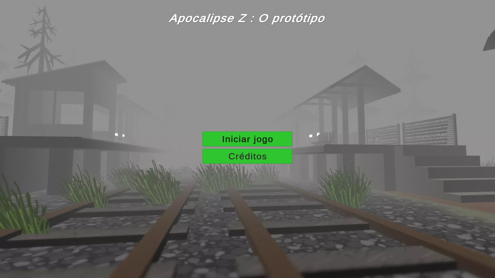
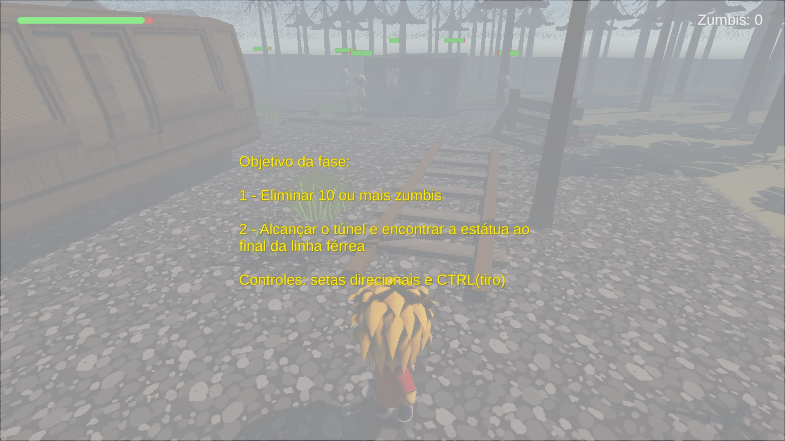
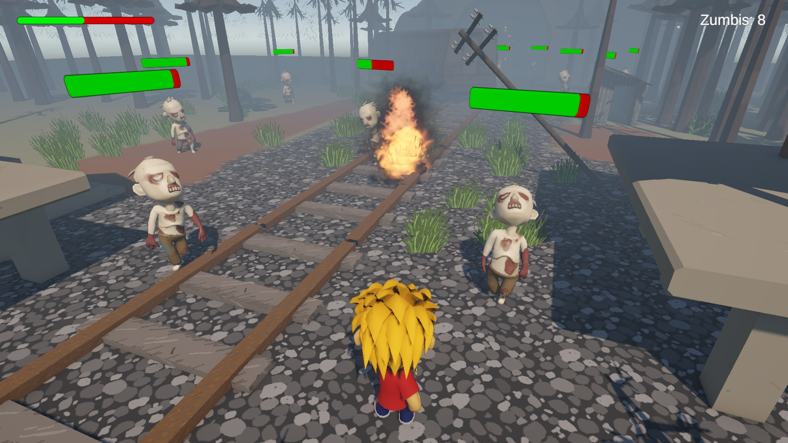
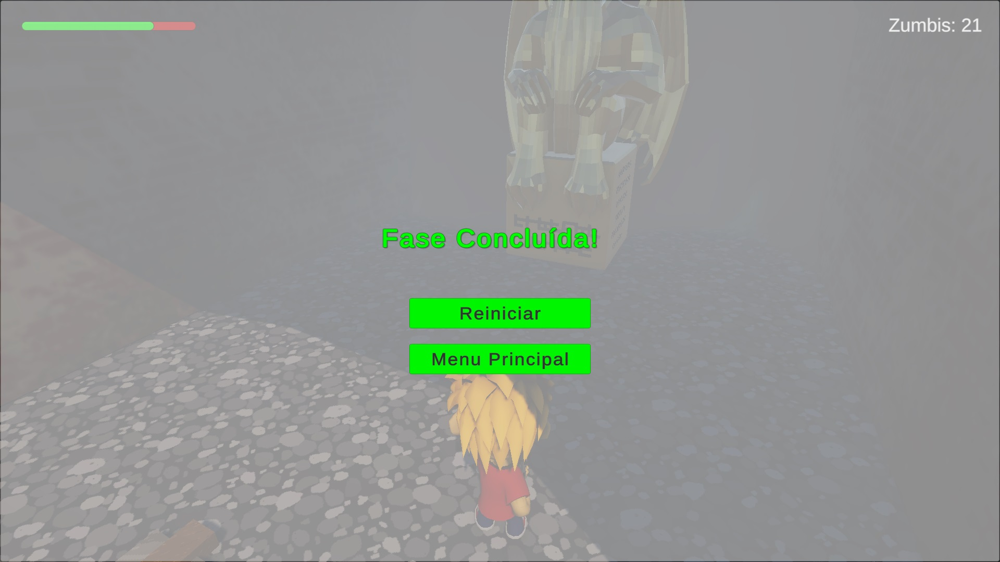

# Projeto Final da Disciplina

# Pós-Graduação em Desenvolvimento Mobile e Cloud Computing – Inatel
## DM117 – Desenvolvimento de jogos com Unity

## Projeto Final da Disciplina : 
Implementação do jogo **Apocalipse Z: O Protótipo**
### 👤 Autor: 
José Enderson Ferreira Rodrigues   
jose.rodrigues@pg.inatel.br, jose.e.f.rodrigues.br@gmail.com

## 📌 Descrição do jogo
**Apocalipse Z: O Protótipo** é um protótipo de jogo de ação e sobrevivência em terceira pessoa, onde o jogador assume o papel de um sobrevivente em um mundo pós-apocalíptico dominado por zumbis. A fantasia principal é a de lutar contra todas as adversidades para sobreviver, explorando um mundo hostil e enfrentando ameaça de zumbis. O objetivo principal deste projeto é testar e validar as mecânicas centrais de movimento, combate e confronto com inimigos. A experiência de jogo será focada em um cenário de combate básico contra zumbis, provando a viabilidade do conceito do jogo.

## 📌 Requisitos atendidos

✅ O projeto deve ter no mínimo 2 cenas

✅ Cena Inicial (Menu): Contém pelo menos um botão funcional “Start Game”.

✅ Cena Inicial (Menu): Pode conter outros botões opcionais (Sair, Créditos, etc.).

✅ Cena do Jogo: Ambiente simples em 2D ou 3D.

✅ Cena do Jogo: Deve implementar pelo menos duas mecânicas básicas (ex.: movimentar personagem, coletar objeto, pular, atirar, etc.).

✅ Funcionalidade: O botão Start Game deve carregar a cena do jogo.

✅ Funcionalidade: O jogador deve ter algum tipo de objetivo ou interação mínima (ex.: coletar 3 itens, atravessar de um lado ao outro, alcançar um ponto específico).

✅ Organização: Nomear corretamente as cenas, scripts e GameObjects principais.

✅ Organização: Usar pastas para organizar Scenes, Scripts e Assets.

✅ Extras Opcionais: Cena final de vitória ou tela de “Game Over”.

✅ Extras Opcionais: Feedback visual ou sonoro (efeito ao coletar item, música de fundo, etc.).

✅ Extras Opcionais: Um contador de pontos ou timer simples.

## 📌 Controles
* Setas direcionas do teclado para movimentação do player
* Botão CTRL para tiro
* Botão Espaço para pular (física não ajustada para essa mecânica)

## 📌 Imagens do jogo
<br>  
<br>  
<br>  
<br> 

## 📌 Detalhamento da solução
#### 📂 Estrutura de pastas dos assets
```
📦DM117-ApocalipseZ-Beta
 ┗📂Assets
   ┣📂Abandoned buildings                          # Asset baixado disponibilizando vários prédios abandonados
   ┣📂Animations             		 
   ┃ ┣📜EnemyAnimController.controller             # Responsável pelas animaçõs dos inimigos(zumbis)
   ┃ ┗📜PlayerAnimController.controller            # Responsável pelas animaçõs do Player
   ┣📂BattleRoyaleDuoPAPBR                         # Asset baixado disponibilizando utilizado para compor o player
   ┣📂GabrielAguiarProductions                     # Asset baixado disponibilizando magias, tiros e poderes
   ┣📂Halloween Game Music Pack                    # Asset baixado disponibilizando música de fundo
   ┣📂pixel horror abandoned rural  train station  # Asset baixado disponibilizando terreno e cenário         	 
   ┣📂Prefabs             		        
   ┃ ┣📜InimigoZombie.prefab                       # Prefab que é utilizado na caracterização dos inimigos (zumbis)
   ┃ ┣📜Player.prefab                              # Prefab que é utilizado na caracterização do Player
   ┃ ┣📜Projetil.prefab                            # Prefab utilizado para construir e testar o tiro
   ┃ ┗📜ProjetilFlame.prefab                       # Prefab que é utilizado na caracterização do tiro flamejante
   ┣📂Scenes             		 
   ┃ ┣📜MainMenu.unity                             # Cena com do Menu principal
   ┃ ┗📜MainScene.unity                            # Cena da execução do jogo
   ┣📂Scripts             		 
   ┃ ┣📜EnemyController.cs                         # Script responsável pelo comportamento e mecânica de movimento dos inimigos (zumbis)
   ┃ ┣📜MainMenuController.cs                      # Script responsável pelas ações do Menu Principal
   ┃ ┣📜PainelIntroScript.cs                       # Script responsável pelas orientações no início da fase
   ┃ ┣📜PlayerController.cs                        # Script responsável pelo comportamento e mecânica de movimento do Player
   ┃ ┗📜ProjetilController.cs                      # Script responsável pelo comportamento e mecânica de tiro
   ┣📂ShootingSound                                # Asset baixado disponibilizando sons de tiro         
   ┣📂SnoozyRat                                    # Asset baixado disponibilizando estátuas usadas na composição do cenário
   ┣📂Sprites                		 
   ┃ ┗📜BackgroundImage.jpeg                       # Imagem de fundo Menu Principal
   ┗📂Supercyan Character Pack Zombie Samples     # Asset baixado disponibilizando utilizado para compor os inimigos (zumbis)
```

  

## 🛠️ IDE
- **Unity 6.2**

## 💻 Linguagem
- **C#**
